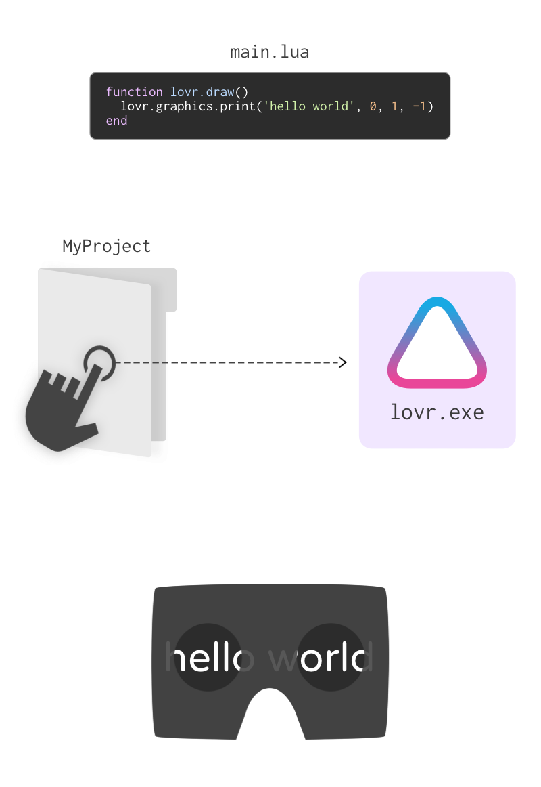
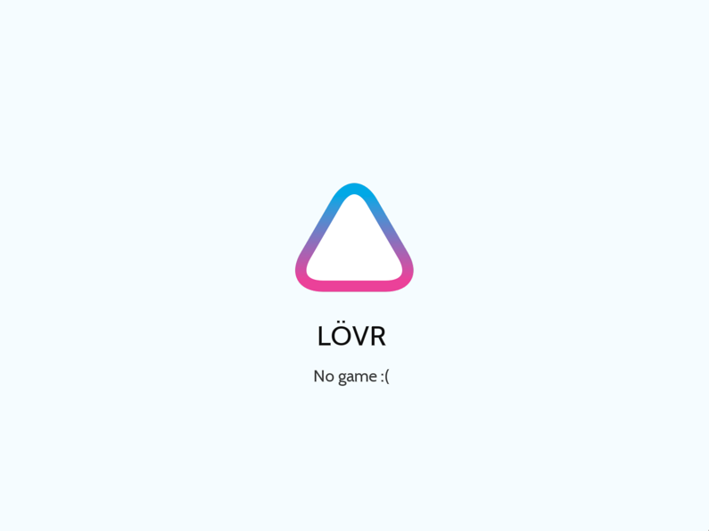
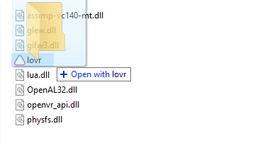

<!--
category: guide
-->

Getting Started
===

This guide will teach you how to install LÖVR, create a simple project, and run it.

Here's an overview of the process:



The rest of this guide will explain these steps in more detail.

Installing LÖVR
---

First, download LÖVR from the website.  Extract the zip archive and open up the folder.  You should
see a file called `lovr.exe` and a bunch of `.dll` files.


Double click on `lovr.exe` to open LÖVR.  You should see a window with the LÖVR logo in it.  This is
what's shown if you run LÖVR without specifying a project.



> Note: If you're using a VR headset, you may see a blank window if your headset isn't
> pointing in the forward direction.  That's fine!

Next we're going to make a project so we see something more interesting than the default screen.

Creating a Project
---

A LÖVR project is just a folder.  The folder can have anything necessary for your experience, like
3D models, sound files, or Lua code.  There isn't any required structure for the folder, so you can
organize it however you want.

There is one special file that LÖVR looks for though, called `main.lua`.  If you put a `main.lua`
file in your project folder, LÖVR will run the code in there when the project starts.

If you haven't already, create a folder for your project and give it a cool name.  Next, create
a file called `main.lua` inside your project folder and type the following Lua code in it:

```
function lovr.draw()
  lovr.graphics.print('hello world', 0, 1.7, -3, .5)
end
```

Don't fret if you're confused about the code, it's not important to understand all of it right now.
In short, we declared the `lovr.draw` function and used `lovr.graphics.cube` in there to draw a cube
at the `(0, 1.7, -2)` position in 3D space every frame.  This will create a cube floating in the air
towards the front of the play area.

Running a Project
---

To run a LÖVR project, drop its folder onto `lovr.exe` (a shortcut also works).



If you followed the example above, you should see the following:


That's all there is to it!

Next Steps
---

The next guide will teach you how to make more sophisticated projects using [Callbacks]().

If you want to learn more about Lua, some good resources are [Learn Lua in 15
Minutes](http://tylerneylon.com/a/learn-lua/) and [Lua for
Programmers](http://nova-fusion.com/2012/08/27/lua-for-programmers-part-1/).

To see some examples of what LÖVR can do, check out the [Examples]() gallery.
